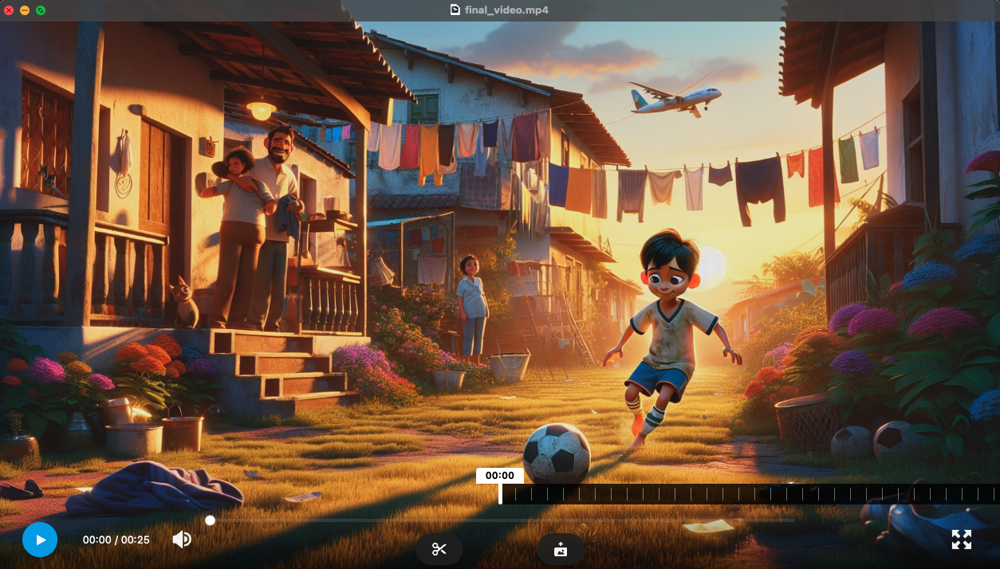

# AI AGENT FOR ANIMATION GENERATOR

## INTRODUCTION



This project is my personal project to generate short animation about any famous biography using CrewAI. The idea is just to take an name of well known person, about 1 minutes video will be generated. However, due to OpenAI restriction policy for generating well known person images, i convert the person name to fictional name. The idea is to produce 1 minute duration of animation videos with the following workflow:

## THE WORKFLOW

### 1. Input Handling:

User Input: Take the name of a famous person from the user.

### 2. Scene Description Generation:

Agent: Scriptwriter  
Task: Generate the overall scene description based on the given person. Due to policy restriction for OpenAI, Dalle 3 can not generate images of well known people and any trademarking or branding element. Therefore, I include in the prompt to change the name of given famous person with any fictional name. Here I assign for the agent to scrape data from web for the actual data. If remove, the agent will use all the knowledge of the OPENAI model.

### 3. Script Generation:

Agent: Screenwriter  
Task: Generate a script for each frame (5-6 seconds per frame) based on scene description.

### 4. Image Generation:

Agent: Scene Illustrator  
Task: Generate images using Dalle 3 for each frame based on the scene descriptions.

### 5. Voice Over Script Generation:

Agent: Voice Over Agent  
Task: Generate the voice-over script for each frame.

### 6. Compile Video:

Agent: Video Editor  
Task: Compile the images, voice-over into a video.

## TECHNOLOGY USED

The following modules are used in this project:

- OpenAI
- CrewAI
- Dalle 3
- LangChain
- Elevenlabs

## GETTING STARTED

To run this demo project, create an virtual environment and install the src package:

1. Clone the repository:

2. create .env files with the following secret keys:

```bash
OPENAI_API_KEY=<your-api-key>
OPENAI_MODEL_NAME=gpt-4o
SERPER_API_KEY=<your-api-key>
ELEVENLABS_API_KEY=<your-api-key>
FIRECRAWL_API_KEY=<your-api-key>

LANGCHAIN_TRACING_V2=true
LANGCHAIN_API_KEY=<your-api-key>

FFMPEG_EXE_PATH=/opt/homebrew/bin/ffmpeg
```

3. Install Dependencies

```bash
pip install -r requirements.txt
```

4. open src/animation/main.py and edit the "famous_name"

5. Run the application

```bash
python src/animation/main.py
```

## Challenges

1. Every animation generated might cost about ~$0.50USD.
2. For some agents, human validation has been set, however upon feedback, the agent make changes but not ask for validation again.
3. For hierarchical process, I unable to customize the Asynchronous Execution of tasks. The process only be done by the manager and you can not customize it.
4. Prompt Engineering need to be done properly for each agents and tasks.

## To Do

1. To generate the voice over narration mp3 file using elevenlabs API.
2. Use Streamlit for the user interface.

## Reference & Documentation

1. [CrewAI Documentation](https://docs.crewai.com/)
2. [Elevenlabs Documentation](https://elevenlabs.io/docs/api-reference/getting-started)
